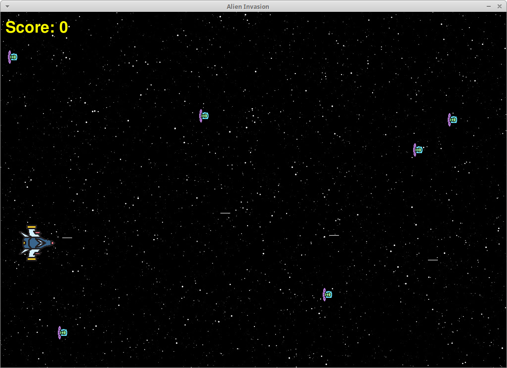
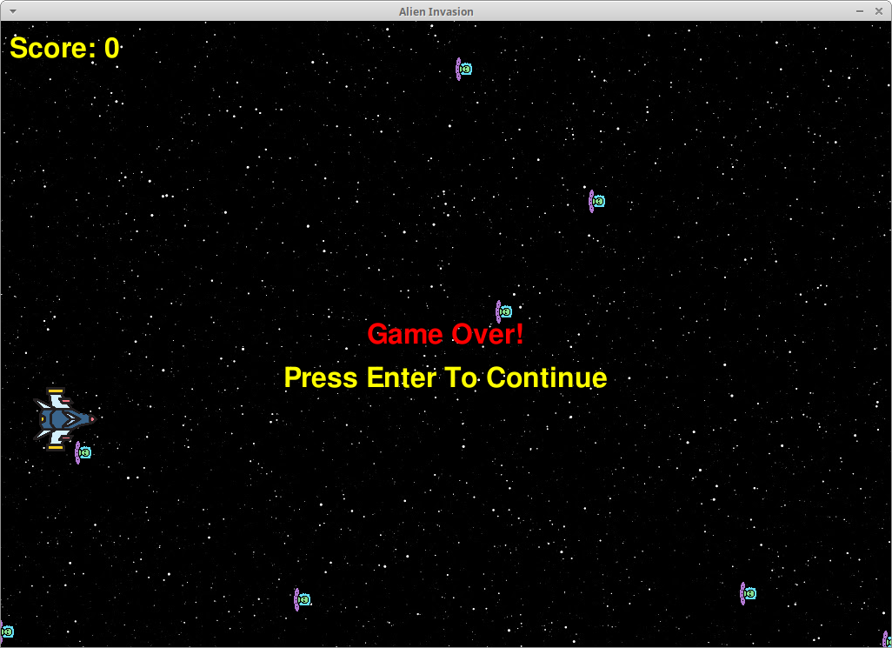

# Alien Invasion
This is one designed to learn how to work with PyGame.

## Virtual Environment
For execution, you create a virtual environment using python venv as follows:

```bash
$ python -venv alien_invasion_env
```

## Install the Requirements
Activate the created environment

```commandline
$ source activate alien_invasion_env/bin/activate
```
Install from requirements.txt file:

```commandline
$ pip install -r requirements.txt 
```

## Execution

```commandline
$ python main.py
```





